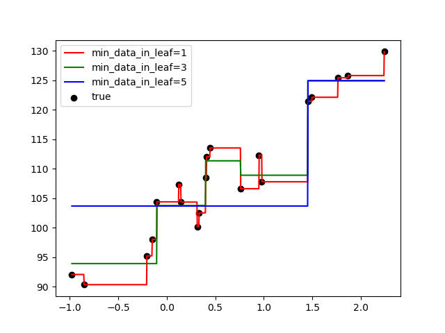
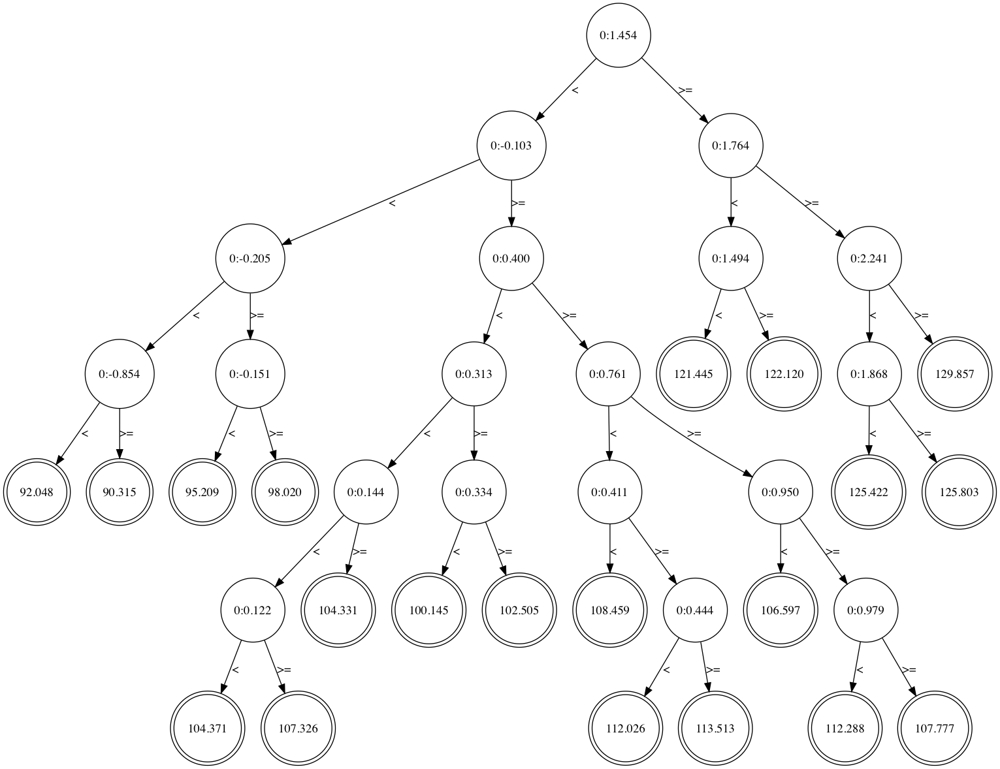
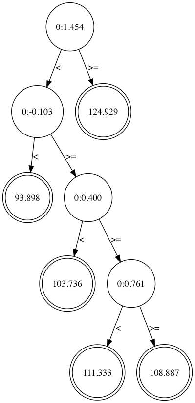
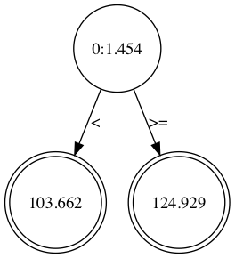

# my-gbrank
full scratch GBrank

GBrank is gradient boosting trees based learning to rank method propoed in 
"A Regression Framework for Learning Ranking Functions Using Relative Relevance Judgments" (Z. Zheng, 2007).

# example

## test_regression_tree.py

### predicted result


### min_data_in_leaf = 1


### min_data_in_leaf = 3


#### min_data_in_leaf = 5


## test_gbrank.py

```
correct order
1A > 1B, 1A > 1C, 1A > 1D, 1B > 1C, 1B > 1D
2B > 2A, 2B > 2C, 2B > 2D
3B > 3A, 3C > 3A, 3A > 3D, 3C > 3B, 3B > 3D, 3C > 3D

predicted order
1A > 1B, 1A > 1C, 1A > 1D, 1B > 1C, 1B > 1D, 1C > 1D
2B > 2A, 2C > 2A, 2B > 2C, 2B > 2D, 2C > 2D
3B > 3A, 3C > 3A, 3A > 3D, 3C > 3B, 3B > 3D, 3C > 3D
```
